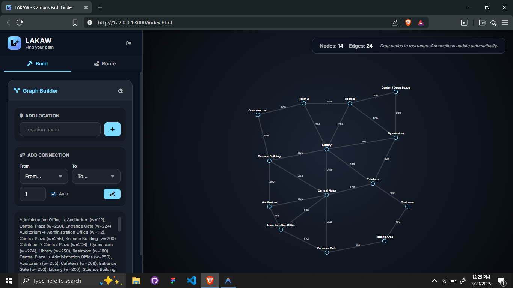
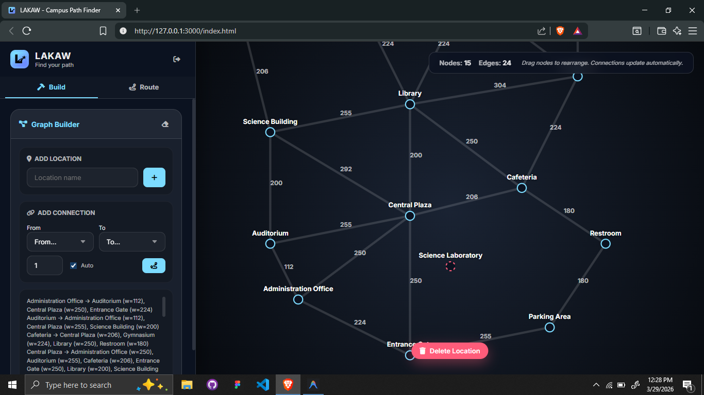
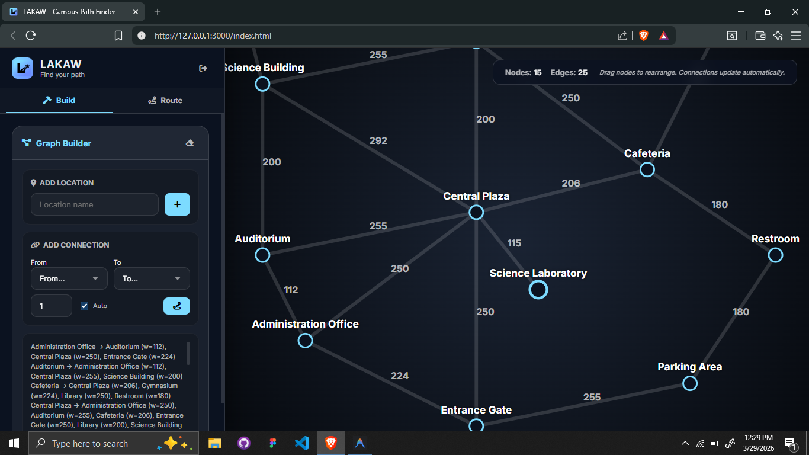
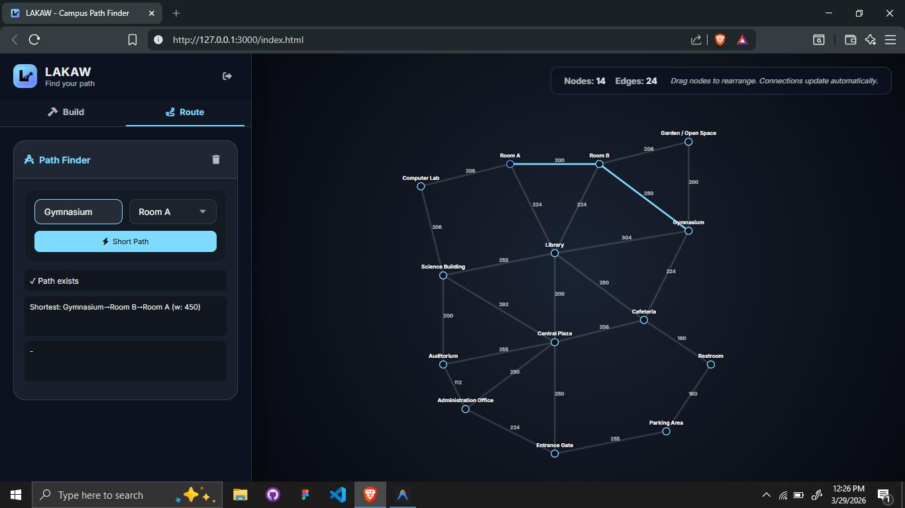
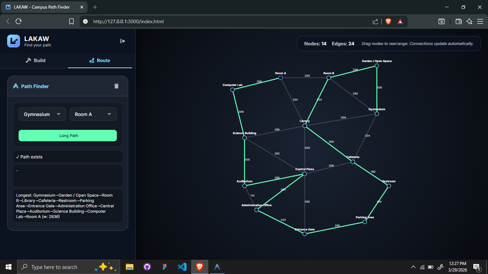

# PROJECT OVERVIEW

# LAKAW — Campus Path Finder

A browser-based **smart campus navigation** demo: an interactive map where locations are graph nodes and walkways are weighted edges. You can edit the graph, drag nodes on an SVG canvas, and compute paths between two points.

## Live Demo
**This project is deployed and live on [Vercel](https://smart-campus-navigation-system-ei3qet5oj.vercel.app)**

---

## What it does

- **Graph builder** — Add named locations and connections. Edge weights can be set manually or **auto-calculated** from node positions (pixel distance).
  - *Canvas Gestures*: Hold `Shift + Drag` between nodes to create a connection. Double-click on any node to rename it, or double-click on any connection weight to manually edit the distance.
  - *Context-aware Deletion*: Click on any node or edge to open a floating toolbar that lets you delete elements.

- **Path finder** — Pick start and destination. The app checks connectivity (**BFS**), then finds either the **shortest path** (**Dijkstra**) or a **longest simple path** (**DFS** with maximum total weight), depending on the mode toggle.

- **Map** — Draggable nodes, zoom (wheel), pan (drag empty canvas), highlighted route, and a live adjacency-style summary.
- **Persistence** — Graph and node coordinates are saved in **localStorage** (`lakaw_graph`, `lakaw_nodes`) and restored on reload.

## Stack

Plain **HTML**, **CSS**, and **JavaScript** (no build step). Uses **Inter** and **Font Awesome** from CDNs.

## Project layout

| Path | Role |
|------|------|
| `index.html` | Page structure and UI |
| `styles/style.css` | Layout and theme |
| `scripts/script.js` | Graph model, algorithms, SVG map, storage |

## Reset data

Use **Build → eraser** (reset to default campus) or **Exit** in the header — both clear saved local data and reload with the built-in sample campus graph.

---

## How to Run Locally

Because this project is built with plain **HTML**, **CSS**, and **Vanilla JavaScript** (no build steps), getting it running locally is incredibly easy:

1. Clone or download the repository to your machine.
2. Simply open `index.html` in any modern web browser.
3. *Alternative:* If you are using VS Code, right-click `index.html` and select **"Open with Live Server"** to view it.

---

## Group Members
1. Agravante, John Patrick E.
2. Nardo, Micha Ella
3. Quintero, Kate G.